# Hi there, I'm BestWaveRock 👋 

  

  <a href="https://github.com/BestWaveRock">
    
    
    
  

---

### 💫 About Me

I am a Software Engineer passionate about backend systems, Apple TV & iOS development, frontend architecture, and desktop utility software. I mainly build applications using **Java, Swift, Python, and Vue** to deliver high-performance, polished user experiences.

- 🏠 **Smart Home**: **ai_housekeeper** - An intelligent smart home companion UI & backend integration.
- 🐾 **Pet Tech & Gamification**: **PetFriendly** - A pet-care platform featuring gamified achievement badge systems.
- 🎛️ **Device Automation**: **TB Control** - Centralized control panel and dashboard utility for hardware/device management.
- 📺 **Apple TV & tvOS**: **ATV-Bilibili-demo** (Apple TV client) and **atvloadly** (IPA sideloading utility) using **Swift**.
- 🤖 **AI Coding**: Dedicated AI Code loyal user, leveraging LLMs like **DeepSeek V4**, **Gemini 3.5 Flash**, and **Qwen 3.6** to supercharge my development workflow.

---

### 🛠️ Tech Stack & Skills

  

---

### 📊 GitHub Analytics

  
  

  

---

### 📂 Featured Projects

| Project | Description | Tech Stack |
| :--- | :--- | :--- |
| 🏠 [**ai_housekeeper**](https://github.com/BestWaveRock/ai_housekeeper) | Intelligent smart home assistant to manage household items and tasks. | Vue / Pinia / Python |
| 🐾 [**PetFriendly**](https://github.com/BestWaveRock/PetFriendly) | Pet friendly utility and social application with rich achievements. | Vue / Swift / Node.js |
| 🎛️ [**TB Control**](https://github.com/BestWaveRock/TB_Control) | Device control and dashboard platform for connected environments. | Java / Electron |
| ☄️ [**AirPodsDesktop**](https://github.com/BestWaveRock/AirPodsDesktop) | AirPods desktop user experience enhancement program for Windows & Linux. | C++ / Qt / Electron |
| 📺 [**ATV-Bilibili-demo**](https://github.com/BestWaveRock/ATV-Bilibili-demo) | Third-party client demo for Apple TV (tvOS). | Swift / Apple TV UI |

---

### 🤝 Connect with Me

- 📧 **Email**: [100petfriendly@gmail.com](mailto:100petfriendly@gmail.com)
- 🌐 **GitHub Profile**: [github.com/BestWaveRock](https://github.com/BestWaveRock)

(<a href="#top">back to top</a>)

